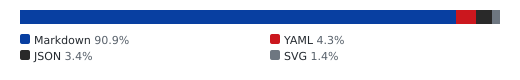
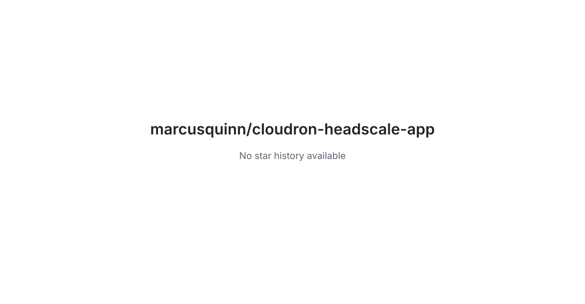

# cloudron-headscale-app

<!-- aidevops:badges:start -->
<!-- managed by aidevops badges; edit the template, not this block -->
<!-- Build & Quality Status -->
[](https://github.com/marcusquinn/cloudron-headscale-app/actions/workflows/loc-badge.yml)

<!-- License & Legal -->
[](https://github.com/marcusquinn/cloudron-headscale-app/blob/main/LICENSE)

<!-- Repository Metrics -->
[](docs/metrics/repo-metrics.md)
[](docs/metrics/repo-metrics.md)
[](docs/metrics/repo-metrics.md)

<!-- Project Links -->
[](https://github.com/marcusquinn/cloudron-headscale-app)
<!-- aidevops:badges:end -->
Headscale self-hosted Tailscale-compatible control server - Cloudron app package

## Install and enrol clients

Install the published package from its Cloudron versions URL. Headscale stores its
SQLite database and keys in `/app/data`, which Cloudron includes in backups.

Create a user and a pre-authentication key from the app terminal:

```sh
headscale users create admin
headscale preauthkeys create --user 1
```

Enrol a client with `tailscale up --login-server https://<app-domain> --authkey <key>`.
The HTTPS origin carries control, Noise, and DERP upgrades. The optional STUN UDP
port defaults to 3479 so it can coexist with apps using UDP 3478.

See [operator documentation](docs/README.md) and [publishing steps](docs/PUBLISHING.md).

<!-- aidevops:managed-readme:start -->
<!-- managed by aidevops; refresh with managed-readme-helper.sh sync -->
## Star History



## Built with aidevops

This project was created and is maintained with
[aidevops.sh](https://aidevops.sh).

[View marcusquinn on GitHub](https://github.com/marcusquinn) ·
[aidevops repository](https://github.com/marcusquinn/aidevops)
<!-- aidevops:managed-readme:end -->
